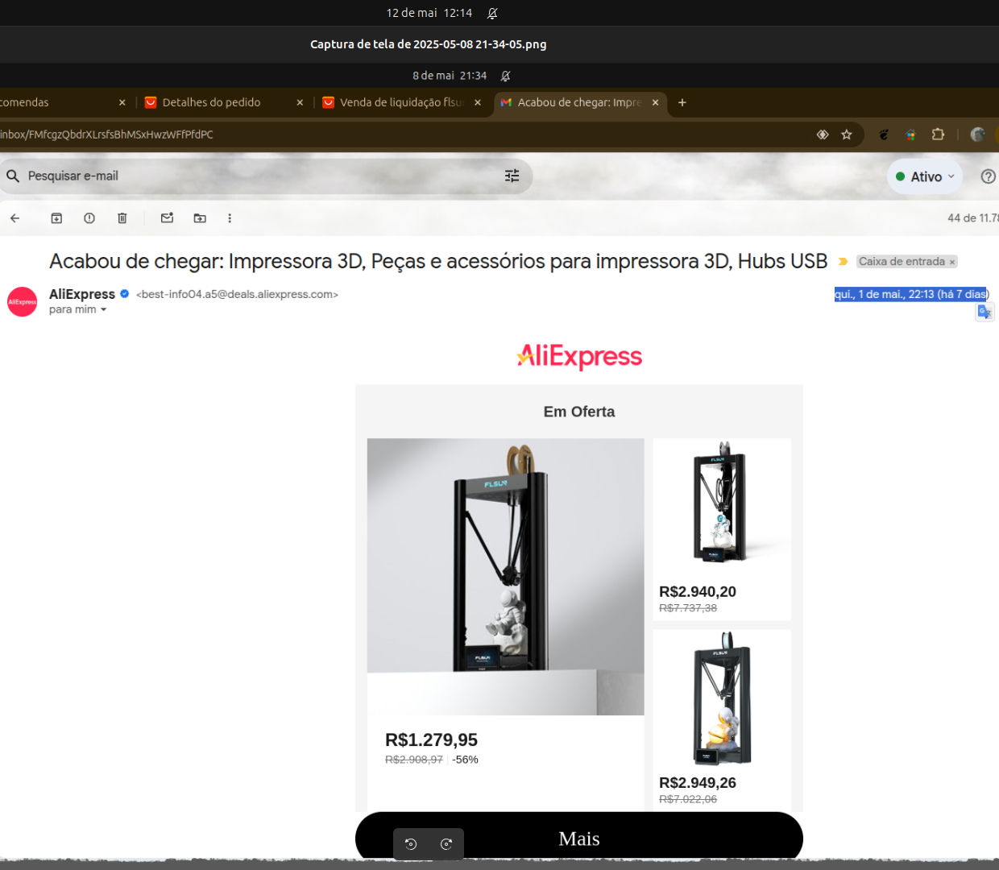
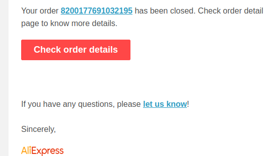
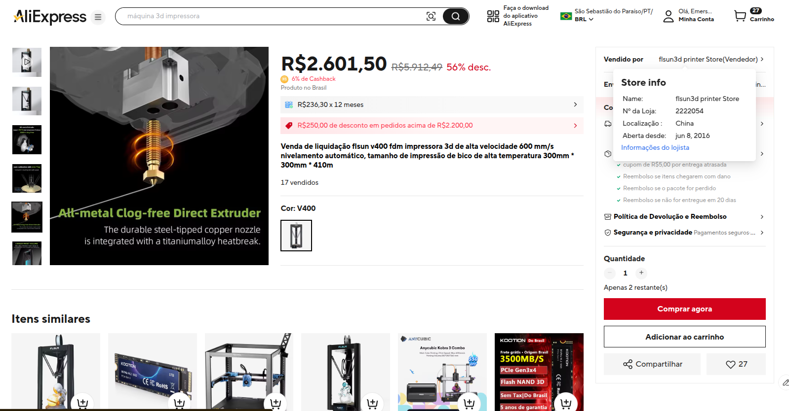
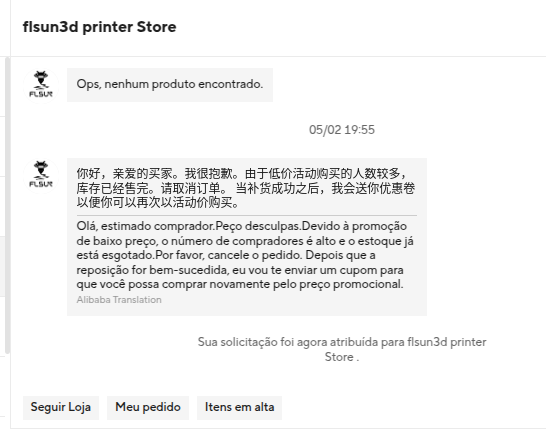

# V400
:heart_eyes:

Há com super promoção comprei um v400 via aliexpress. 01/05/2025
56% desc. real... ou não? hoje em preparação de envio.

[Link V400 Aliexpress](https://pt.aliexpress.com/item/1005008874607143.html?spm=a2g0o.order_list.order_list_main.5.4b9ecaa4ZW68mv&gatewayAdapt=glo2bra"Link")

[porque](GitHubFLSunV400.md)

[v400 files](linksV400.md)

[Especificação Hardware](HardwareFLSunV400.md)

[Manual](https://github.com/eeichhorn/Flsun-v400/blob/main/original-v400-USB-files/FlsunV400%20English%20Instruction%20Manual.pdf "Manual.Pdf")

[Markdown](https://docs.github.com/pt/get-started/writing-on-github/getting-started-with-writing-and-formatting-on-github/basic-writing-and-formatting-syntax "Markdownlink")

09/05/2025 é nada de envio... que pena. acho que mudar o titulo para ...

:disappointed_relieved:

:disappointed_relieved:

12/05/2025

14/05/2025

:rage: 
é propaganda enganosa... agora forçado a pedir reembolso, sem presente. :´( 
:rage:
agora tem estoque ... 16/05/2025 falta de estoque apenas para nao cumprir o pedido. como no e-mail. como no pedido.

:broken_heart:

